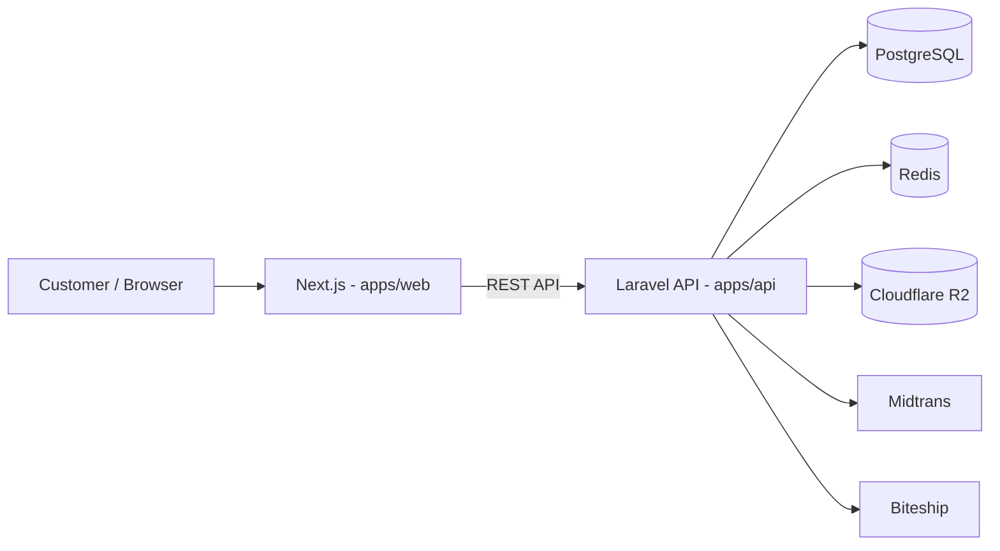

# Batik-Nusantara

<p align="center">
  <em>Platform ecommerce single-store untuk toko batik Indonesia.</em>
</p>

<p align="center">
  []()
  [](https://github.com/kevinnazarr)
</p>

<p align="center">
  **Status:** In Development (scaffolding) &nbsp;·&nbsp; **Demo:** Belum tersedia &nbsp;·&nbsp; **Dokumentasi:** [docs/](docs/)
</p>

Batik-Nusantara adalah project ecommerce fullstack yang menjual produk olahan batik — kemeja, dress, blouse, outer, kain batik, sarung, tas, dompet, scarf, dan produk batik lainnya. Dibangun dengan dua tujuan: menjadi aplikasi ecommerce yang realistis dan siap dikembangkan menuju production, sekaligus menjadi project portfolio fullstack.

| | |
| --- | --- |
| **Jenis** | Ecommerce single-store |
| **Status** | In Development (scaffolding) |
| **Demo** | Belum tersedia |
| **Lisensi** | Belum ditentukan |
| **Author** | [kevinnazarr](https://github.com/kevinnazarr) |

## Daftar Isi

| | |
| --- | --- |
| [Tentang Project](#tentang-project) | [Fitur Utama](#fitur-utama) |
| [Tech Stack](#tech-stack) | [Arsitektur](#arsitektur) |
| [Struktur Project](#struktur-project) | [Persyaratan](#persyaratan) |
| [Clone Repository](#clone-repository) | [Mulai Cepat](#mulai-cepat) |
| [Menjalankan Frontend](#menjalankan-frontend) | [Menjalankan Backend](#menjalankan-backend) |
| [Environment Variables](#environment-variables) | [Database](#database) |
| [Docker](#docker) | [Testing](#testing) |
| [Development Workflow](#development-workflow) | [API](#api) |
| [Authentication](#authentication) | [Pembayaran](#pembayaran) |
| [Pengiriman](#pengiriman) | [Object Storage](#object-storage) |
| [Dokumentasi](#dokumentasi) | [Roadmap](#roadmap) |
| [Preview](#preview) | [Security](#security) |
| [Contributing](#contributing) | [License](#license) |
| [Author](#author) | |

---

## Tentang Project

Batik-Nusantara dirancang sebagai ecommerce **single-store** untuk toko batik. Target utama adalah UMKM/toko batik Indonesia yang ingin memiliki toko online modern tanpa meninggalkan identitas produk lokalnya.

Project ini bernilai dari dua sisi:

1. **Sebagai aplikasi** — mendemonstrasikan bagaimana ecommerce modern dibangun secara end-to-end: katalog produk, transaksi, pembayaran, pengiriman multi-courier, hingga panel admin.
2. **Sebagai portfolio fullstack** — memperlihatkan disiplin engineering: arsitektur monorepo, API yang terstruktur, dokumentasi, dan praktik pengembangan yang rapi.

> **Catatan status:** repository saat ini baru berisi scaffolding — struktur direktori, konfigurasi Docker untuk database, dan kerangka dokumentasi. Aplikasi (`apps/web` dan `apps/api`) belum diinisialisasi.

## Fitur Utama

Seluruh fitur di bawah adalah **target scope** project. Karena aplikasi belum diimplementasikan, semua fitur berstatus **Direncanakan**.

### Customer (Direncanakan)

- Katalog produk batik
- Pencarian produk
- Filter dan sortir produk
- Halaman detail produk
- Varian produk (ukuran, warna, motif)
- Keranjang belanja
- Guest checkout
- Autentikasi pelanggan (email/password, Google OAuth)
- Manajemen alamat
- Wishlist
- Riwayat pesanan
- Tracking pesanan

### Commerce (Direncanakan)

- Pembayaran melalui Midtrans (snap, virtual account, dan metode lain yang tersedia)
- Pengiriman multi-courier melalui Biteship
- Manajemen inventori/stok
- Promosi dan kupon

### Admin (Direncanakan)

- Dashboard admin
- Manajemen produk
- Manajemen kategori
- Manajemen varian/SKU
- Manajemen inventori
- Manajemen pesanan
- Manajemen pelanggan
- Manajemen banner
- Manajemen konten/story
- Manajemen promosi

## Tech Stack

Daftar berikut adalah target teknologi project. Stack akan terpasang saat `apps/web` dan `apps/api` diinisialisasi.

### Frontend

[](https://nextjs.org)
[](https://react.dev)
[](https://www.typescriptlang.org)
[](https://tailwindcss.com)
[](https://gsap.com)
[](https://motion.dev)
[](https://lenis.darkroom.engineering)

### Backend

[](https://laravel.com)
[](https://www.php.net)
[](https://laravel.com/docs/sanctum)

### Database & Cache

[](https://www.postgresql.org)
[](https://redis.io)

### Infrastructure

[](https://www.docker.com)
[](https://www.cloudflare.com)
VPS

### Payment, Shipping & Storage

[](https://midtrans.com)
[](https://biteship.com)
[](https://developers.cloudflare.com/r2/)

## Arsitektur

> Diagram berikut adalah **target arsitektur**. Komponen aplikasi belum diimplementasikan dan akan diaktualkan seiring perkembangan project.



Penjelasan komponen:

- **Next.js (`apps/web`)** — frontend ecommerce: katalog, keranjang, checkout, dan halaman admin. Berkomunikasi dengan backend melalui REST API.
- **Laravel API (`apps/api`)** — REST API utama: autentikasi (Sanctum), produk, pesanan, pembayaran, pengiriman, dan admin.
- **PostgreSQL** — database utama untuk data transaksional.
- **Redis** — cache dan antrian (queue) untuk job seperti notifikasi dan webhook.
- **Cloudflare R2** — object storage S3-compatible untuk gambar produk, banner, dan media lain.
- **Midtrans** — payment gateway untuk memproses pembayaran.
- **Biteship** — shipping aggregator untuk tarif, label, dan tracking multi-courier.

## Struktur Project

Kondisi repository saat ini:

```text
batik-nusantara/
├── .github/
│   └── workflows/     # placeholder untuk CI/CD
├── docs/
│   ├── api/           # rencana: spesifikasi API
│   ├── architecture/  # rencana: dokumentasi arsitektur
│   ├── frontend/      # rencana: dokumentasi frontend
│   └── guides/        # rencana: panduan development
├── infra/             # rencana: konfigurasi infrastruktur & deployment
├── scripts/           # rencana: script otomasi development
├── compose.yaml       # PostgreSQL 16 + Redis 7 untuk development
├── .editorconfig
├── .gitignore
└── README.md
```

Fungsi masing-masing directory:

| Path | Fungsi |
| --- | --- |
| `apps/web` | Frontend Next.js (belum dibuat, akan diinisialisasi) |
| `apps/api` | Backend Laravel REST API (belum dibuat, akan diinisialisasi) |
| `docs/` | Dokumentasi project: API, arsitektur, frontend, dan panduan |
| `infra/` | Konfigurasi infrastruktur dan deployment |
| `scripts/` | Script otomasi untuk development |
| `.github/workflows/` | Workflow CI/CD (placeholder, belum diisi) |
| `compose.yaml` | Service PostgreSQL dan Redis untuk development |

## Persyaratan

Yang dibutuhkan saat ini:

- **Docker** dengan plugin **Docker Compose** — untuk menjalankan PostgreSQL dan Redis.

Versi Node.js, npm, PHP, dan Composer belum dapat ditentukan karena `apps/web` dan `apps/api` belum diinisialisasi. Bagian ini akan diperbarui setelah scaffolding aplikasi dimulai.

## Clone Repository

### SSH

```bash
git clone git@github.com:kevinnazarr/batik-nusantara.git
cd batik-nusantara
```

### HTTPS

```bash
git clone https://github.com/kevinnazarr/batik-nusantara.git
cd batik-nusantara
```

## Mulai Cepat

Yang dapat langsung dijalankan saat ini adalah service database dan cache:

```bash
docker compose up -d
```

Aplikasi frontend dan backend belum tersedia — lihat [Roadmap](#roadmap) untuk tahapan selanjutnya.

## Menjalankan Frontend

Frontend (`apps/web`) belum diinisialisasi. Panduan ini akan diisi setelah aplikasi Next.js di-scaffold — mencakup `npm install`, `npm run dev`, `npm run build`, dan `npm run lint`.

## Menjalankan Backend

Backend (`apps/api`) belum diinisialisasi. Panduan ini akan diisi setelah aplikasi Laravel di-scaffold — mencakup `composer install`, konfigurasi `.env`, migrasi database, dan menjalankan server.

## Environment Variables

File `.env.example` belum tersedia; daftar di bawah adalah **rencana** dan akan diaktualkan bersamaan dengan scaffolding aplikasi. Jangan pernah meng-commit nilai asli.

| Variable | App | Fungsi |
| --- | --- | --- |
| `NEXT_PUBLIC_API_URL` | web | Base URL API Laravel |
| `DB_CONNECTION`, `DB_HOST`, `DB_PORT`, `DB_DATABASE`, `DB_USERNAME`, `DB_PASSWORD` | api | Koneksi PostgreSQL |
| `REDIS_HOST`, `REDIS_PORT` | api | Koneksi Redis |
| `SANCTUM_STATEFUL_DOMAINS` | api | Domain yang diizinkan untuk autentikasi Sanctum |
| `GOOGLE_CLIENT_ID`, `GOOGLE_CLIENT_SECRET` | api | Google OAuth |
| `MIDTRANS_SERVER_KEY`, `MIDTRANS_CLIENT_KEY` | api | Payment gateway Midtrans |
| `BITESHIP_API_KEY` | api | Shipping aggregator Biteship |
| `R2_ACCOUNT_ID`, `R2_ACCESS_KEY_ID`, `R2_SECRET_ACCESS_KEY`, `R2_BUCKET` | api | Object storage Cloudflare R2 |

## Database

Database utama adalah **PostgreSQL 16**, dijalankan via Docker Compose. Nama database development: `batik_nusantara` (lihat `compose.yaml`).

- Migrasi dan seeder **belum tersedia** — akan dibuat bersama scaffolding `apps/api` (Laravel).
- Rencana: migration untuk produk, kategori, varian/SKU, stok, pesanan, pelanggan, promosi, dan konten.

## Docker

Docker Compose digunakan untuk menjalankan service pendukung development. Saat ini hanya database dan cache yang berjalan via Docker — aplikasi web dan API belum di-containerize.

Mulai service:

```bash
docker compose up -d
```

Periksa status:

```bash
docker compose ps
```

Lihat log:

```bash
docker compose logs -f
```

Hentikan service:

```bash
docker compose down
```

| Service | Image | Port host | Fungsi |
| --- | --- | --- | --- |
| `postgres` | `postgres:16-alpine` | `5432` | Database utama |
| `redis` | `redis:7-alpine` | `6380` | Cache dan queue |

Catatan: Redis diekspos di port host `6380` (bukan `6379`) untuk menghindari konflik dengan Redis lokal bila ada.

## Testing

Belum ada test — aplikasi belum di-scaffold. Rencana:

- **Frontend:** lint, typecheck, dan unit test.
- **Backend:** PHPUnit/Pest untuk unit test dan feature test.

Panduan perintah aktual akan ditambahkan setelah scaffolding selesai.

## Development Workflow

Alur kerja yang disarankan untuk project ini:

```text
Issue
 ↓
Branch
 ↓
Development
 ↓
Test
 ↓
Pull Request
 ↓
Review
 ↓
Merge
```

Penamaan branch:

```text
feat/...
fix/...
refactor/...
docs/...
chore/...
```

Gunakan Conventional Commits:

```text
feat: add product catalog
fix: handle expired payment
docs: update installation guide
```

## API

Rencana:

- REST API Laravel di `apps/api` dengan autentikasi Sanctum.
- Versioning API (`/api/v1/...`).
- Dokumentasi OpenAPI akan diletakkan di `docs/api/`.

Belum ada endpoint yang tersedia saat ini.

## Authentication

Rencana autentikasi:

- Email/password
- Google OAuth
- Laravel Sanctum (token untuk SPA)
- Guest checkout (tanpa akun)

| Peran | Deskripsi |
| --- | --- |
| Guest | Pengunjung tanpa akun — browsing katalog dan guest checkout |
| Registered Customer | Pelanggan terdaftar — akun, alamat, wishlist, riwayat dan tracking pesanan |
| Admin | Pengelola toko — dashboard dan manajemen produk, pesanan, dan konten |

## Pembayaran

Rencana integrasi Midtrans sebagai payment gateway. Alur umum:

```text
Frontend → Laravel API → Midtrans → Webhook → Update status order
```

- Selama pengembangan, Midtrans dijalankan dalam mode **sandbox**.
- Webhook harus divalidasi untuk memastikan update status order hanya berasal dari Midtrans.
- Secret key tidak akan pernah dicantumkan di repository.

## Pengiriman

Rencana penggunaan **Biteship** sebagai shipping aggregator. Alur umum:

```text
Origin → Destination → Shipping rates → Courier service → Shipment → Tracking
```

Courier yang tersedia (misalnya J&T, JNE, SiCepat, dan lainnya) mengikuti konfigurasi akun Biteship — daftar aktual tidak diklaim sebelum dikonfigurasi.

## Object Storage

Rencana penggunaan **Cloudflare R2** sebagai object storage S3-compatible untuk:

- Gambar produk
- Banner
- Cover story/konten
- Media lainnya

Penggunaan R2 (S3-compatible) memudahkan migrasi antar provider object storage bila diperlukan.

## Dokumentasi

Dokumentasi project tersedia di folder `docs/`:

- [Arsitektur](docs/architecture/)
- [API](docs/api/)
- [Frontend](docs/frontend/)
- [Panduan](docs/guides/)

Folder-folder tersebut masih berisi placeholder dan akan diisi seiring perkembangan project.

## Roadmap

**Selesai**

- Scaffolding struktur repository (docs, infra, scripts, .github)
- Docker Compose untuk PostgreSQL 16 dan Redis 7

**Direncanakan**

- Inisialisasi `apps/web` (Next.js)
- Inisialisasi `apps/api` (Laravel + Sanctum)
- Katalog produk dan kategori
- Autentikasi (email/password, Google OAuth)
- Keranjang dan checkout
- Integrasi Midtrans
- Integrasi Biteship
- Object storage Cloudflare R2
- Panel admin
- Testing (unit dan feature)
- CI/CD via GitHub Actions
- Deployment ke VPS dengan Cloudflare

## Preview

Preview akan ditambahkan setelah UI utama selesai.

## Security

- Jangan pernah meng-commit `.env` atau file yang berisi secret.
- Gunakan HTTPS pada production.
- Validasi signature webhook (Midtrans, Biteship) sebelum memproses data.
- Terapkan authorization pada seluruh endpoint admin.
- Jangan mengekspos production credentials ke publik.

Jika menemukan security issue, silakan gunakan jalur pelaporan yang ditentukan oleh repository. Saat ini belum ada `SECURITY.md`; jalur pelaporan akan ditentukan kemudian.

## Contributing

Alur kontribusi sederhana:

```text
Fork / branch → perubahan → test → pull request
```

- Ikuti penamaan branch dan Conventional Commits (lihat [Development Workflow](#development-workflow)).
- Pastikan perubahan tidak melanggar konvensi yang ada di repository.

## License

> Lisensi belum ditentukan.

## Author

Project ini dikelola oleh [kevinnazarr](https://github.com/kevinnazarr).

[](https://github.com/kevinnazarr)

---

<p align="center">
  Dibangun untuk Batik-Nusantara sebagai project ecommerce fullstack modern.
</p>