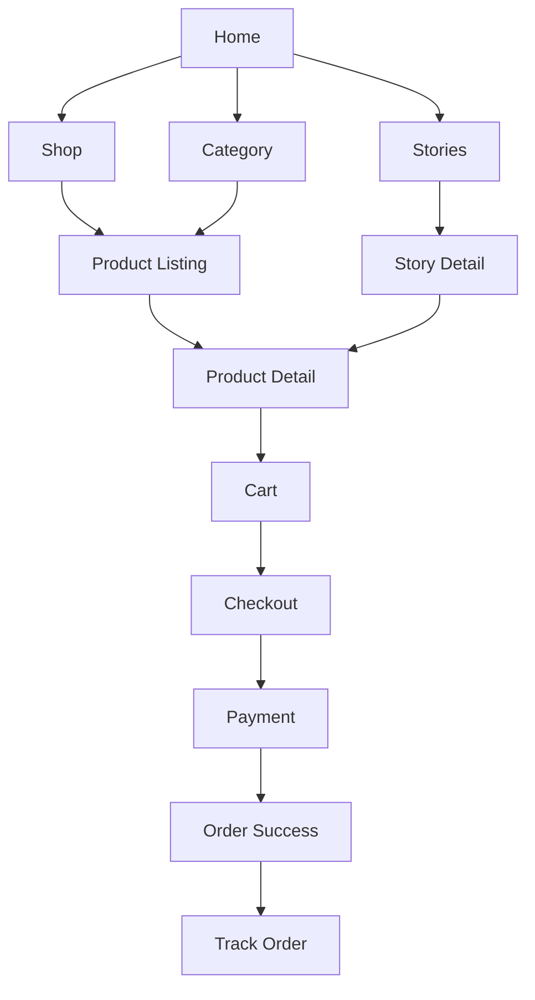
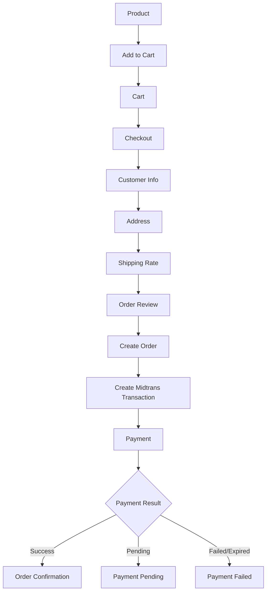
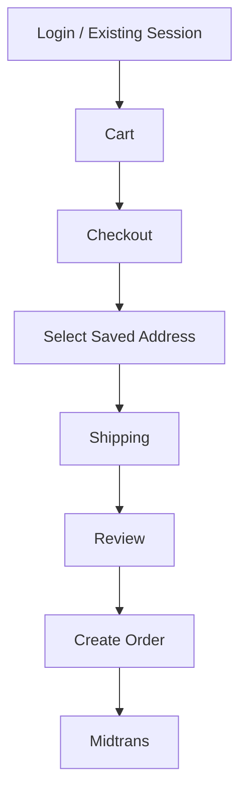
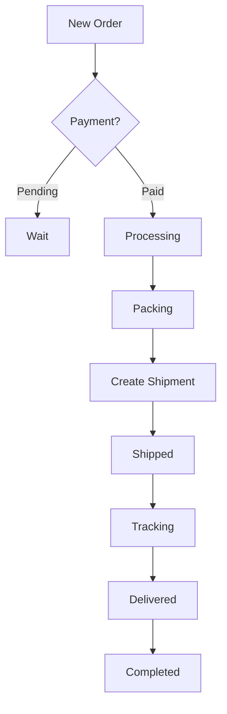

# 04 — UX Flows

## 1. Information architecture

## 2. Guest checkout

## 3. Registered checkout

## 4. Admin order flow

## 5. UX rules

- CTA utama harus terlihat tanpa interaksi rumit.
- Guest checkout tidak disembunyikan di belakang login.
- Error checkout bersifat actionable.
- Loading state tidak menghilangkan context.
- Mobile first untuk checkout.
- Animation harus menghormati `prefers-reduced-motion`.
- Form address menggunakan field terstruktur untuk kebutuhan shipping API.

## 6. Checkout screens

1. Cart summary.
2. Contact information.
3. Shipping address.
4. Shipping method.
5. Order summary.
6. Payment.
7. Order success.
8. Track order.
